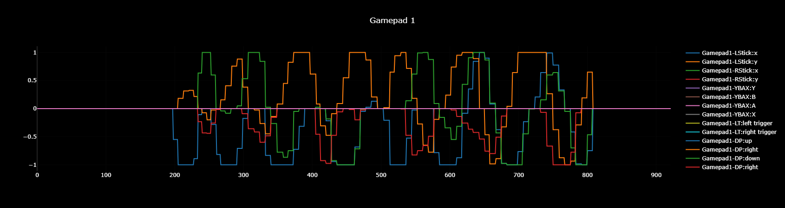

# Overload 9161
This is the file we developed to allow us to plot the data our robot collects on easy to read graphs

## The data
The data from the robot is stored in .txt files

## The plotter
Once you get the data and place it in the webpage, the graph will look like this:
